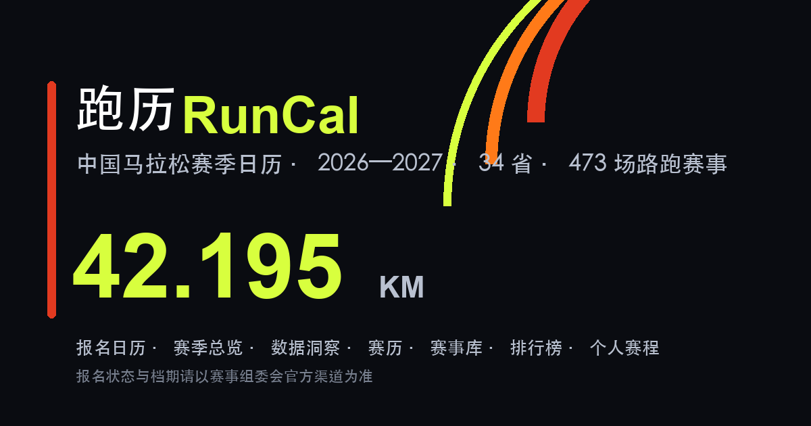

# 跑历 RunCal · 中国马拉松赛季日历



一个只看赛历、报名窗口和赛道难度的中国路跑赛事日历。把散落在各赛事官网、政府公告、田协名单里的信息，
整理成一张能筛、能排、能对比的表——**没有资讯流，没有社区，不做代报名**。

- 🔗 在线地址：https://fb29a65789044909aaeee128c296f109.app.workbuddy.link
- 📦 源码仓库：https://github.com/moonquake2004/runcal
- 📅 数据快照：**2026-09-05**（473 场赛事，覆盖 34 个省级行政区、205 座城市）
- 📄 许可：MIT（见 [LICENSE](LICENSE)；赛事名称、logo、官方赛道图版权归各组委会）


---

## 它解决什么问题

马拉松赛事信息有三个老毛病：**散**（每场赛事一个官网一个公众号）、**变**（报名时间反复调整）、**虚**
（"最快赛道""最容易PB"全是营销话术）。跑历的做法是把这三类信息拆开处理：

| 问题 | 做法 |
| --- | --- |
| 信息散 | 473 场赛事集中成一张表，支持按省份 / 城市 / 月份 / 等级 / 项目 / 状态交叉筛选 |
| 时间变 | 报名窗口精确到开抢时刻，每条都标注来源；官方未公布的显示"待官宣"，不猜 |
| 评价虚 | 赛道难度只用可核查的硬指标（累计爬升、关门时间、海拔），并附来源链接 |

## 主要功能

**赛历与检索**
- 赛事库：卡片 / 时间轴双视图，10 个筛选维度（关键词、赛季、区域、省份、城市、月份、等级、项目、报名状态、报名窗口），可交叉叠加
- 赛历时间轴：按日期滚动，一眼看到哪个月是赛季高峰
- 赛事对比：最多 4 场同屏横向对比 14 项（日期、地区、标牌、田协等级、项目、规模、报名状态、男女赛会纪录、中国籍最好成绩、赛道标签、报名入口）
- 详情弹窗：赛道纪录、历届冠军与成绩、中国选手最好成绩、赛道难度（爬升 / 关门 / 海拔 + 来源）
- 近期值得跑：从"未过期 + 有赛道难度数据"的未来赛事中，按 低难度 → 报名中 → 临近 自动挑选 3 场
- 赛季白皮书：可下载的《中国马拉松赛季白皮书 2026—2027》（6 页 PDF，含春秋双峰节奏、区域版图、PB 赛道榜 TOP12、规模榜）

**报名**
- 报名日历：按开抢 / 截止时刻升序，展示最近 8 条；已截止的自动移出
- 报名状态五态语义色：报名中（绿）、待开启（黄）、已截止（灰红）、已结束（灰）、待官宣（虚线）
- 精确的开抢 / 截止时间，逐条标注来源出处；**官方未公布截止日的只标"待核实"，绝不臆造**

**数据洞察**
- 月度分布、区域分布图表
- 城市赛道榜：34 个省级行政区热度矩阵 + 205 座城市榜，指标为赛事数、PB 友好指数、平均爬升
- 排行榜：国内赛事纪录、中国选手最好成绩、世界纪录、世界六大满贯

**个人工具（数据只存在你的浏览器里）**
- PB 档案 + 我的赛程（localStorage，不上传）
- 配速换算器：目标成绩 → 每公里配速 + 5km 分段
- 赛事对比托盘：随手勾选，凑够再比

**其他**
- 移动端筛选抽屉（≤720px 自动变底部弹层）
- 卡片键盘可达（Tab 聚焦 + Enter/Space 打开），带 `:focus-visible` 焦点环
- 可"添加到主屏幕"（PWA manifest，含 192/512/maskable 图标）
- 暗色 / 明亮双主题，选择记在 localStorage
- 页面内置更新记录（右上角「更新记录」）

## 数据来源与口径

**这是本项目最花力气的部分。**所有数据坚持一条底线：**能查证的才写，查不到就写"官方未公布 / 待核实"，绝不臆造。**

- 赛事清单、日期、等级（A1/A/B/C、世界田联标牌）：中国田径协会认证名录、赛事组委会公告
- 报名窗口：赛事官网报名须知、主办城市人民政府网、本地宝等，**逐条带 `src` 来源字段**
- 赛道难度（累计爬升 / 关门时间 / 海拔）：官方竞赛规程、百度百科赛道数据，**逐条带 `src` 来源字段**
- 赛道纪录、历届冠军、中国选手最好成绩：赛事官方成绩公告、中国田协
- 世界纪录、六大满贯：World Athletics、各赛事官网

已知的不完整之处（**公开说明，不掩饰**）：
1. 缺少官方逐公里海拔剖面数据，因此赛道难度只用"累计爬升 + 关门时间 + 海拔描述"三件套，不做精确的坡度图
2. 2027 赛季（107 场）多为待官宣状态，日期可能变动
3. 赛事口碑、中签率等主观/未公开指标一律留白

## 快速开始

```bash
git clone https://github.com/moonquake2004/runcal.git
cd runcal
node server.js
# 打开 http://localhost:3000
```

> ⚠️ 不要直接双击 `index.html`。数据层用 `fetch` 加载 `data/*.json`，`file://` 协议会被浏览器 CORS 策略拦住。
> 必须通过 HTTP 服务访问（`node server.js` 或任意静态服务器，如 `npx serve`）。

零依赖：只用 Node 内置模块（`http` / `fs` / `path`），**不需要 `npm install`**。

## 项目结构

```
runcal/
├── index.html              # 单页应用（唯一 HTML 入口）
├── server.js               # 单端口 HTTP 服务：静态托管 + 访问统计
├── manifest.json           # PWA 配置
├── package.json
├── assets/
│   ├── css/style.css       # 全部样式
│   ├── js/
│   │   ├── loader.js       # 数据层：拉清单 → 并行 fetch JSON → 注入 app.js
│   │   └── app.js          # 主程序（渲染、筛选、弹窗、图表）
│   ├── icons/              # PWA 图标 192 / 512 / maskable / apple-touch
│   ├── img/courses/        # 赛道图（厦门、济南、眉山）
│   ├── og-cover.png        # 社交分享封面
│   └── report/             # 赛季白皮书 PDF
├── data/                   # ★ 唯一数据源（运行时 fetch）
│   ├── index.json          # 清单：声明要加载哪些文件、挂到哪个全局变量
│   ├── races-2026.json     # 366 场
│   ├── races-2027.json     # 107 场
│   └── …（详见下表）
└── tools/
    ├── build-json.js       # 一次性迁移脚本（legacy JS → JSON）
    └── legacy/             # 归档的历史 JS 数据文件，运行时不再引用
```

## 数据文件说明

| 文件 | 内容 | 规模 |
| --- | --- | --- |
| `races-2026.json` | 2026 赛季赛事 | 366 场 |
| `races-2027.json` | 2027 赛季赛事 | 107 场 |
| `race-diff.json` | 赛道难度（爬升 / 关门 / 海拔 / 评级 / 来源） | 65 场 |
| `race-reg.json` | 报名窗口（开抢 / 截止 / 名额规则 / 来源） | 17 场 |
| `race-reg-as-of.json` | 报名状态快照时点 | 10 条 |
| `race-results.json` | 历届冠军 / 成绩 | 34 场 |
| `course-records.json` | 赛道纪录（男女） | 68 场 |
| `cn-best.json` | 中国选手在该赛事的最好成绩 | 53 场 |
| `world-records.json` | 世界纪录（男女） | 2 组 |
| `world-majors.json` | 世界马拉松六大满贯 | 7 场 |
| `race-urls.json` | 官方报名 / 官网链接 | 20 条 |
| `course-images.json` | 赛道图映射 | 3 场 |

赛事记录采用**紧凑数组**格式（为减小体积），字段顺序见 `app.js` 的 `FIELDS`：

```js
['name','city','province','region','date','caa','wa','dist','scale','status','tags','note','confirmed']
```

| 字段 | 含义 | 取值示例 |
| --- | --- | --- |
| `dist` | 项目 | `F` 全程 / `H` 半程 / `T` 10公里 / `R` 欢乐跑，可组合如 `FH` |
| `caa` | 中国田协等级 | `A1` / `A` / `B` / `C` |
| `wa` | 世界田联标牌 | `白金标` / `金标` / `精英标` / `标牌` |
| `status` | 报名状态 | `open` 报名中 / `soon` 待开启 / `closed` 已截止 / `done` 已结束 / `tba` 待官宣 |
| `scale` | 赛事规模 | 参赛名额数 |
| `confirmed` | 是否已核实 | 未核实的不参与排序加权 |

## 数据加载流程

`index.html` 只引一个脚本 `loader.js`，加载流程：

```
data/index.json（清单）
  → 并行 fetch 12 个 data/*.json
  → 挂到 window.RACES_2026 / RACES_2027 / RACE_DIFF …
  → 注入 assets/js/app.js（保证数据就绪后才初始化）
```

任一请求失败会显示明确错误提示，而不是白屏。

## 如何更新数据

1. 直接编辑 `data/*.json`（这是唯一数据源，`tools/legacy/*.js` 仅供归档参考）
2. 同步更新 `data/index.json` 里的 `snapshot` 字段，以及 `app.js` 里的 `DATA_SNAPSHOT` 常量
3. **改完必须 bump 缓存版本号**：`index.html` 里 `loader.js?v=YYYYMMDDx` 和 `loader.js` 里的 `VER` 常量，
   两处保持一致，否则 CDN / 浏览器会继续用旧缓存
4. `tools/build-json.js` 是一次性迁移工具（legacy JS → JSON，含往返校验），后续赛季数据无需再跑

## 部署

```bash
PORT=3000 node server.js   # 默认 3000
```

任何能跑 Node 的地方都可以（VPS、容器、CloudStudio、Railway 等）。
若部署到纯静态托管（GitHub Pages / Vercel / Netlify 静态模式），页面能正常显示，
但 `server.js` 提供的访问统计接口会失效——前端已做容错，不会报错。

## 隐私说明

- 不采集任何个人信息，无需注册登录
- 无第三方统计脚本、无广告、无 Cookie 追踪
- 访问量统计只做一件事：按 IP 去重计数，**同一 IP 5 分钟窗口内只计 1 次**
- 计数结果写入 `data/visits.json`，该文件已被 `.gitignore` 排除，且服务端禁止外部访问（`/data/visits.json` 返回 403）
- 个人 PB、我的赛程只存在浏览器 `localStorage`，不上传

## 已知限制

- 未实现 Service Worker，**暂不支持离线访问**（"添加到主屏幕"后可像 App 一样打开，但仍需联网）
- 无官方逐公里海拔数据，不做赛道坡度剖面图
- 数据为人工整理的非实时快照，报名信息请以赛事官方公告为准

## 许可

MIT License（见 [LICENSE](LICENSE)）。赛事数据为公开渠道人工整理，欢迎使用，但请自行核实时效性；
赛事名称、logo、官方赛道图等素材版权归各赛事组委会所有。

---

数据整理难免有疏漏。发现错误欢迎提 [Issue](https://github.com/moonquake2004/runcal/issues)
或 PR，**请附上官方来源链接**——这是本项目唯一接受的更正方式。
